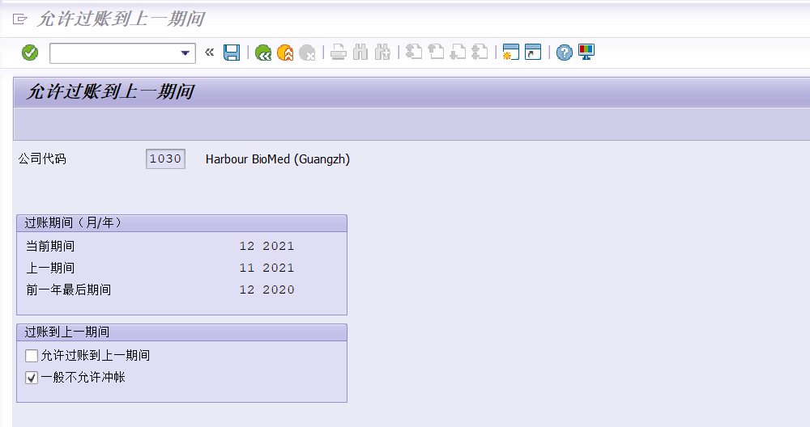

想省事儿的直接拖到后面查看代码
###思路分析
#####实现逻辑:初版
>	1. 前台测试：选择屏幕确认公司代码。必要情况手动开账勾选前台执行按钮
>		- 1.1去marv表找公司代码的当前账期，简单运算获取下一个账期。
>		- 1.2执行bdc，模拟前台手动开账期
>		- 1.3执行的必要信息存日志表。例：修改人（开账期的人）,修改时间，地点，错误原因，执行次数等
>	2. 后台job
>		- 2.1sm36创建后台job，设置起始日期月末，时间24:00.每月执行一次。
>		- 2.2其他逻辑同上
>
>存在问题:bdc执行程序，出现跳转新页面，此时无法被录屏程序捕获。

当前期间为2021-12，故我们前台填写2022-01
下图为shdb的录屏

点击执行按钮之后，录屏程序直接认为任务完成。开始结算。

然后贴一个正常的手操前台mmpv
会返回一个日志屏幕

因为这个日志屏幕，我们无法通过录屏执行一个完整的mmpv激活账期。因此思路1失败。

#####实现逻辑修改版
>	实现逻辑修改版
>	1. 前台测试：选择屏幕确认公司代码。必要情况手动开账勾选前台执行按钮
>		- 1.1去marv表找公司代码的当前账期，简单运算获取下一个账期。
>		- 1.2submit mmpv执行程序，传入选择屏幕必要值。
>		- 1.3执行bdc录屏，勾选一般不允许冲账并保存。
>		- 1.4执行的必要信息存日志表。例：修改人（开账期的人）,修改时间，地点，错误原因，执行次数等
>	2. 后台job
>		- 2.1sm36创建后台job，设置起始日期月末，时间24:00.每月执行一次。
>		- 2.2其他逻辑同上
>
>存在问题：不是思路问题，是技术问题。
在submit程序之后，进入日志屏幕，然后退出的时候，不执行后续程序。(已解决)
示例代码：
被调用程序
>```abap
>*&---------------------------------------------------------------------*
>*& Report ZTEST_KEVIN
>*&---------------------------------------------------------------------*
>*&
>*&---------------------------------------------------------------------*
>REPORT ztest_kevin.
>PERFORM frm_20220530."测试
>*&---------------------------------------------------------------------*
>*& Form frm_20220530
>*&---------------------------------------------------------------------*
>*& text
>*&---------------------------------------------------------------------*
>*& -->  p1        text
>*& <--  p2        text
>*&---------------------------------------------------------------------*
>FORM frm_20220530 .
>  WRITE:/ '进入文本屏幕'.
>ENDFORM.
>```
调用程序
>```abap
>*&---------------------------------------------------------------------*
>*& Report ZTEST_KEVIN2
>*&---------------------------------------------------------------------*
>*&
>*&---------------------------------------------------------------------*
>REPORT ztest_kevin2.
>PERFORM frm_20220530."测试调用其他程序
>*&---------------------------------------------------------------------*
>*& Form frm_20220530
>*&---------------------------------------------------------------------*
>*& text
>*&---------------------------------------------------------------------*
>*& -->  p1        text
>*& <--  p2        text
>*&---------------------------------------------------------------------*
>FORM frm_20220530 .
>  DATA:ls_line TYPE zfit018.
>  SUBMIT ztest_kevin AND RETURN.
>  cl_demo_output=>display( '会执行这句么' ).
>  ls_line = VALUE #( bukrs = '9999'
>                     lfgja = '2022'
>                     lfmon = '01'
>                     znum = '01' ).
>  SELECT * FROM zfit018
>    INTO TABLE @DATA(lt_zfit018)
>    WHERE bukrs = @ls_line-bukrs
>    AND lfgja = @ls_line-lfgja
>    AND lfmon = @ls_line-lfmon.
>  SORT lt_zfit018 BY bukrs lfgja lfmon znum DESCENDING.
>  DELETE ADJACENT DUPLICATES FROM lt_zfit018 COMPARING bukrs lfgja lfmon znum.
>  IF lt_zfit018 IS NOT INITIAL.
>    CLEAR:ls_line.
>    READ TABLE lt_zfit018 INTO ls_line INDEX 1.
>    ls_line-znum += 1.
>  ELSE.
>    ls_line-aenam = 'DLW_KEVIN'.
>    ls_line-laeda = sy-datum.
>    ls_line-uzeit = sy-uzeit.
>    ls_line-zkqfs = '01'.
>    ls_line-msg = '本条消息记录仅用于测试，无实际含义'.
>  ENDIF.
>  MODIFY zfit018 FROM ls_line.
>  CLEAR:ls_line.
>ENDFORM.
>```
>因为涉及到后台，故增加了写日志的操作。
原问题原因是submit调用程序之后，没有返回`and return`，故卡在了被调用程序页面，退出后也不会执行后续。

###直接贴代码
```abap
****************************************************************************
* 事务代码：                                                      *
* 程序名称：                                                      *
* 程序目的： 自动开账期                                        *
* 申 请 人：                                                              *
* 设 计 人： DLW_KEVIN                                                             *
* 设计时间： 2022.05                                                            *
* 程序类型:  report                                                       *
* 描    述: <div>自动开账期</div>                                                                       *
*(修改日志)----------------------------------------------------------------*
* 日志号 修改人   修改时间 修改说明   传输号码                             *
* ------ ------   -------- ---------  ---------                            *
****************************************************************************
REPORT zfir_billingperiod.

DATA:ls_marv TYPE marv.
DATA:lv_lfgja TYPE marv-lfgja."年度
DATA:lv_lfmon TYPE marv-lfmon."期间

DATA:gt_bdcdata   TYPE TABLE OF bdcdata.
DATA:gt_msg TYPE TABLE OF bdcmsgcoll,
     gv_msg TYPE bapi_msg,
     gs_msg TYPE bdcmsgcoll.
DATA:lv_msg TYPE bapi_msg.

DATA:ls_line TYPE zfit018."存日志

"后台执行

SELECTION-SCREEN BEGIN OF BLOCK blk1 WITH FRAME TITLE TEXT-t01.
  PARAMETERS: p_test  TYPE c AS CHECKBOX  DEFAULT 'X',
              p_bukrs TYPE bukrs.
SELECTION-SCREEN END OF BLOCK blk1.

START-OF-SELECTION.
  CLEAR:ls_line."清空，防止出现问题
  IF sy-batch = 'X' OR p_test = 'X'."后台调用或者前台测试
    IF sy-batch = 'X'.
      ls_line-zkqfs = '02'.
    ELSE.
      ls_line-zkqfs = '01'.
    ENDIF.

    PERFORM frm_getdata."获取需要开启的账期

    PERFORM frm_submit."执行mmpv

    PERFORM frm_mmrv."勾选mmrv

    PERFORM frm_savelog."存日志


  ENDIF.
*&---------------------------------------------------------------------*
*& Form frm_getdata
*&---------------------------------------------------------------------*
*& text
*&---------------------------------------------------------------------*
*& -->  p1        text
*& <--  p2        text
*&---------------------------------------------------------------------*
FORM frm_getdata ."取当期账期MARV
  IF p_bukrs IS INITIAL.
    MESSAGE TEXT-e01 TYPE 'S' DISPLAY LIKE 'E'.
    LEAVE LIST-PROCESSING.
  ENDIF.
  CLEAR:ls_marv,lv_lfgja,lv_lfmon.
  "获取公司代码的当前账期，并进行简单计算获取下个账期
  SELECT SINGLE *
    FROM marv INTO @ls_marv
    WHERE bukrs = @p_bukrs.

  IF ls_marv IS INITIAL.
    MESSAGE TEXT-e02 TYPE 'S' DISPLAY LIKE 'E'.
    LEAVE LIST-PROCESSING.
  ENDIF.
  lv_lfgja = ls_marv-lfgja."当前期间的会计年度
  lv_lfmon = ls_marv-lfmon."当前期间（过账期间）

  IF lv_lfmon = '12'."取下一期
    lv_lfmon = '01'.
    lv_lfgja += 1.
  ELSE.
    lv_lfmon += 1.
  ENDIF.

  "获取执行的期间年度
  ls_line-lfgja = lv_lfgja.
  ls_line-lfmon = lv_lfmon.
  ls_line-bukrs = p_bukrs.

  SELECT zfit018~bukrs,
    zfit018~lfgja,
    zfit018~lfmon,
    zfit018~znum
    FROM zfit018
    INTO TABLE @DATA(lt_zfit018)
    WHERE bukrs = @p_bukrs
    AND lfmon = @lv_lfmon
    AND lfgja = @lv_lfgja.

  IF lt_zfit018 IS NOT INITIAL."获取执行次数，用于统计原因
    SORT lt_zfit018 BY bukrs lfgja lfmon znum DESCENDING.
    DELETE ADJACENT DUPLICATES FROM lt_zfit018 COMPARING ALL FIELDS.

    READ TABLE lt_zfit018 INTO DATA(ls_zfit018) INDEX 1.
    IF sy-subrc = 0.
      ls_line-znum = ls_zfit018-znum + 1.
    ENDIF.
  ELSE.
    ls_line-znum = 1.
  ENDIF.

ENDFORM.
*&---------------------------------------------------------------------*
*& Form frm_mmrv
*&---------------------------------------------------------------------*
*& text
*&---------------------------------------------------------------------*
*& -->  p1        text
*& <--  p2        text
*&---------------------------------------------------------------------*
FORM frm_mmrv .
  CLEAR:gt_bdcdata.
  "开始执行录屏
  PERFORM frm_bdc_dynpro      USING 'SAPMM03Y' '0100' .
  PERFORM frm_bdc_field       USING 'BDC_CURSOR' 'MARV-BUKRS'.
  PERFORM frm_bdc_field       USING 'BDC_OKCODE' '/00'.

  PERFORM frm_bdc_field       USING 'MARV-BUKRS' p_bukrs.

  PERFORM frm_bdc_dynpro      USING 'SAPMM03Y' '0110' .
  PERFORM frm_bdc_field       USING 'BDC_CURSOR' 'MARV-XRUEM'.
  PERFORM frm_bdc_field       USING 'BDC_OKCODE' '=BU'.

  PERFORM frm_bdc_field       USING 'MARV-XRUEV' 'X'.
  PERFORM frm_bdc_field       USING 'MARV-XRUEM' ''.


  CALL TRANSACTION 'MMRV' USING gt_bdcdata
                    MODE 'A'"N后台 A前台
*                        MODE 'A'
                    UPDATE 'S'
                    MESSAGES INTO gt_msg.
  LOOP AT gt_msg INTO gs_msg.
    CALL FUNCTION 'MESSAGE_TEXT_BUILD'
      EXPORTING
        msgid               = gs_msg-msgid
        msgnr               = gs_msg-msgnr
        msgv1               = gs_msg-msgv1
        msgv2               = gs_msg-msgv2
        msgv3               = gs_msg-msgv3
        msgv4               = gs_msg-msgv4
      IMPORTING
        message_text_output = lv_msg.
    IF gv_msg IS INITIAL.
      gv_msg = lv_msg.
    ELSE.
      CONCATENATE gv_msg lv_msg INTO gv_msg SEPARATED BY ';'.
    ENDIF.
  ENDLOOP.
  IF gv_msg IS NOT INITIAL AND gv_msg <> '已执行功能'.
    MESSAGE gv_msg TYPE 'S' DISPLAY LIKE 'E'.
  ELSE.
    CONCATENATE '开启 会计年度' lv_lfgja '期间'  lv_lfmon  INTO gv_msg SEPARATED BY '' .
    MESSAGE gv_msg TYPE 'S'.
  ENDIF.
  ls_line-msg = gv_msg.
  ls_line-aenam = sy-uname.
  ls_line-laeda = sy-datum.
  ls_line-uzeit = sy-uzeit.
ENDFORM.

FORM frm_bdc_dynpro USING program TYPE sy-cprog
                      dynpro  TYPE sy-dynnr.

  DATA: gs_bdcdata TYPE bdcdata.
  gs_bdcdata-program  = program.
  gs_bdcdata-dynpro   = dynpro.
  gs_bdcdata-dynbegin = 'X'.
  APPEND gs_bdcdata TO gt_bdcdata.

ENDFORM.                    "BDC_DYNPRO
*----------------------------------------------------------------------*
*        Insert field                                                  *
*----------------------------------------------------------------------*
FORM frm_bdc_field USING fnam TYPE any
                     fval TYPE any.

  DATA: gs_bdcdata TYPE bdcdata.
  gs_bdcdata-fnam = fnam.
  gs_bdcdata-fval = fval.
  CONDENSE gs_bdcdata-fval.
  APPEND  gs_bdcdata TO gt_bdcdata.

ENDFORM.                    "BDC_FIELD
*&---------------------------------------------------------------------*
*& Form frm_savelog
*&---------------------------------------------------------------------*
*& text
*&---------------------------------------------------------------------*
*& -->  p1        text
*& <--  p2        text
*&---------------------------------------------------------------------*
FORM frm_savelog .
*  ls_line-msg = gv_msg.
*  ls_line-aenam = sy-uname.
*  ls_line-laeda = sy-datum.
*  ls_line-uzeit = sy-uzeit.

  MODIFY zfit018 FROM ls_line .

ENDFORM.
*&---------------------------------------------------------------------*
*& Form frm_submit
*&---------------------------------------------------------------------*
*& text
*&---------------------------------------------------------------------*
*& -->  p1        text
*& <--  p2        text
*&---------------------------------------------------------------------*
FORM frm_submit .
*  CONCATENATE '开启 会计年度' lv_lfgja '期间'  lv_lfmon INTO gv_msg SEPARATED BY '' .
**    MESSAGE gv_msg TYPE 'S'.
*  PERFORM frm_savelog.

  SUBMIT rmmmperi
    WITH i_bbukr = p_bukrs
    WITH i_lfgja = lv_lfgja
    WITH i_lfmon = lv_lfmon
    WITH i_vbukr = p_bukrs
    WITH i_xcomp = 'X'
    WITH i_xmove = ''
    AND RETURN."返回屏幕
*  IF sy-subrc = 0.
*
*  ELSE.
*
*  ENDIF.

ENDFORM.
```

调用后台job：sm36

定义变式，切记使用仅用于后台，甚至勾选上仅在目录显示，防止误修改参数。

